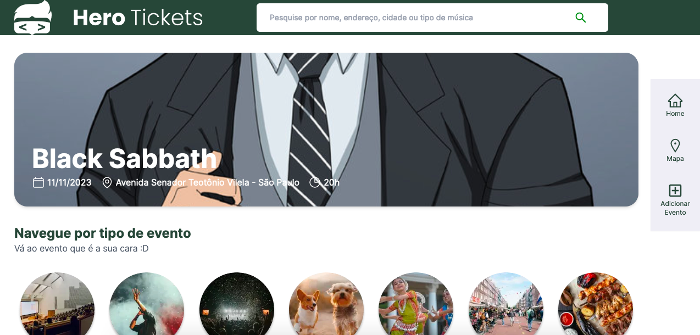
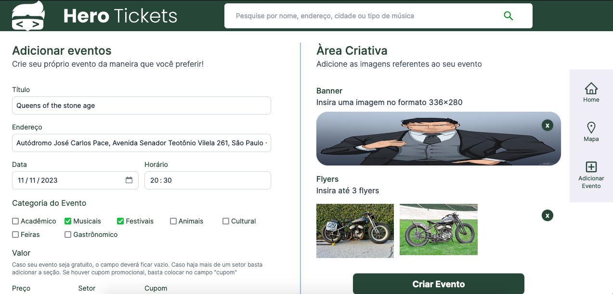
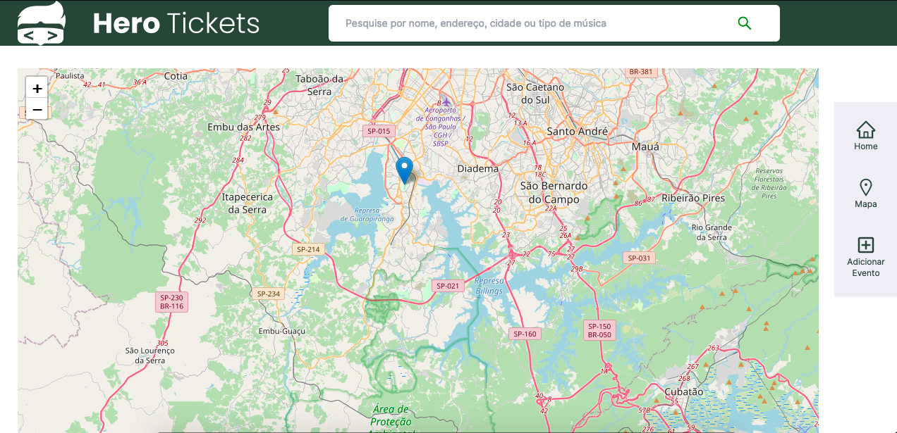

# Tickets 💊

<p>
Tickets é uma plataforma prática que permite aos usuários criar eventos,
adicionando fotos, endereços a até mesmo latitude e longitude do local especifico. Com esta aplicação, criar um evento nunca foi tão simples e acessível.
</p>

# Screens

<p align="center">
  
  
  
</p>

## Technologies used

- [ReactJS](https://pt-br.reactjs.org)
- [NextJS](https://nextjs.org)
- [Typescript](https://www.typescriptlang.org)
- [Tailwindcss](https://tailwindcss.com)
- [React Hook Form](https://zod.dev/)
- [Zod](https://www.react-hook-form.com/)
- [Leaflet](https://react-leaflet.js.org/)

## Requirements

You need to install [Node.js](https://nodejs.org)

## How to use it

```bash
# Repository clone
$ git clone https://github.com/Gui-dev/tickets.git
# Install the dependencies
$ npm install
# Run the web server
$ npm run dev
```

The app will be available for access on your browser at (http://localhost:3000)
